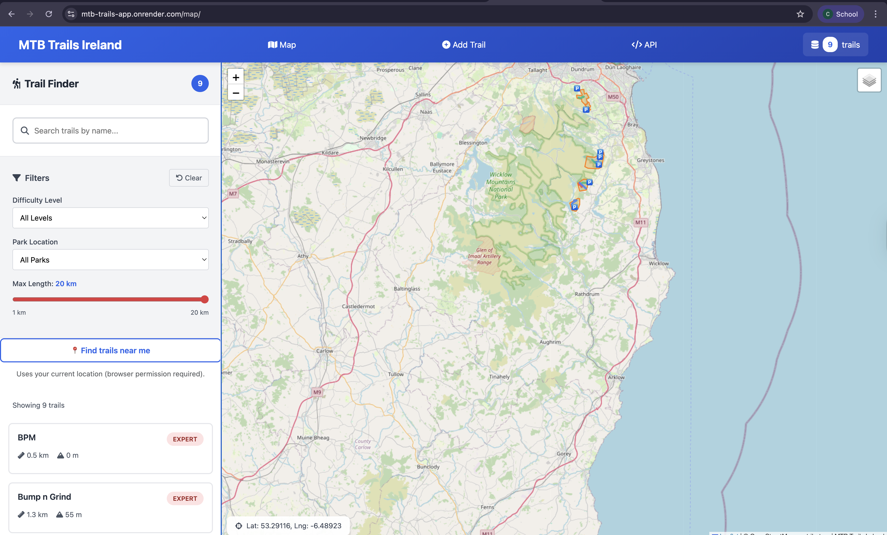

# MTB Trails Ireland — GeoDjango + PostGIS + Leaflet

A Location-Based Services (LBS) web app to **view, search, add, and find nearby** mountain-bike trails in Ireland.  
Backed by **Django/GeoDjango + PostGIS**, exposed via **Django REST Framework**, and rendered with **Leaflet** as GeoJSON.  
Deployed as a **Dockerized** app on **Render** with a managed **PostgreSQL + PostGIS** database.

---

## Features

- **Interactive web map**
  - Leaflet map centered on Ireland
  - OSM base tiles
  - Trails rendered from GeoJSON

- **Spatial trail data**
  - Trails stored as GeoDjango `LineString` (SRID 4326)
  - Parks/areas stored as polygons
  - APIs return GeoJSON FeatureCollections

- **Search & filter**
  - Filter trails by park and difficulty
  - Text search by trail name

- **Proximity & geolocation**
  - “Near me” search using browser geolocation
  - Proximity endpoint with `lat`, `lng`, and `radius` parameters

- **Data management**
  - Django admin for creating/editing:
    - Parks
    - Trails
    - POIs (Points of Interest)

- **Read-only trails list**
  - Separate list view of all trails with key attributes

- **Cloud deployment**
  - Dockerfile for reproducible builds
  - Deployed on Render as a Docker web service
  - Managed PostgreSQL database with PostGIS extension

---

## Tech Stack

- **Backend**
  - Django / GeoDjango
  - Django REST Framework
  - `drf-gis` for GeoJSON support

- **Database**
  - PostgreSQL + PostGIS

- **Frontend**
  - Leaflet
  - Bootstrap 5
  - Vanilla JavaScript

- **Deployment**
  - Docker (custom Dockerfile)
  - Render (Web Service + managed PostgreSQL)
  - Environment-based settings (local vs cloud)

---

## Architecture

- **MVC (Django)**
  - Models: Parks, Trails, POIs (GeoDjango models with spatial fields)
  - Views:
    - HTML views for map and list pages
    - DRF API views for JSON/GeoJSON
  - URL routing:
    - `/` and `/map/` → map UI
    - `/api/...` → JSON/GeoJSON APIs

- **Spatial logic (PostGIS)**
  - Proximity search using distance filters
  - Geometry stored in SRID 4326
  - GeoJSON serialization via `drf-gis`

- **Deployment architecture**
  - Django app container built from `Dockerfile`
  - Render web service runs container with:
    - `collectstatic`
    - `migrate`
    - `gunicorn`
  - Separate Render PostgreSQL service with PostGIS extension enabled

---

## Live Deployment

The app is deployed on Render as a Dockerized web service with a managed PostgreSQL/PostGIS database.

- **Cloud provider:** Render
- **Runtime:** Docker
- **Database:** Render PostgreSQL (PostGIS enabled via `CREATE EXTENSION postgis;`)

> Note: Replace this section with your actual live URL if you want to share it publicly.

---

## Quickstart (Local, non-Docker)

```bash
# 1. Clone + create virtual environment
git clone https://github.com/ConorFee/MTBLBS-Project.git
cd MTBLBS-Project
python -m venv .venv && source .venv/bin/activate  # Windows: .venv\Scripts\activate

# 2. Install dependencies
pip install --upgrade pip
pip install -r requirements.txt

# 3. Create Postgres DB with PostGIS enabled
# In psql:
CREATE DATABASE mtbdb;
\c mtbdb
CREATE EXTENSION postgis;

# 4. Configure environment variables
cp .env.example .env  # Then edit DB fields for local PostGIS

# 5. Run migrations + start server
python manage.py migrate
python manage.py runserver
```

---

## Quickstart (Docker + Docker Compose)

Local development can also be run fully containerized:

```bash
# Build and run services
docker compose up --build

# If you need a clean rebuild
docker compose build --no-cache
docker compose up
```

- Django backend runs inside a Python container  
- PostgreSQL + PostGIS runs as a separate container  
- Environment variables are read from `.env`  

---

## API Reference

All spatial responses return **GeoJSON** by default.

| Endpoint | Method | Purpose | Notes |
|---------|--------|---------|-------|
| `/api/trails/` | GET | List all trails | GeoJSON Feature list via `drf-gis` |
| `/api/trails/` | POST | Create trail | Payload: name, difficulty, length, path(WKT `LINESTRING`) |
| `/api/trails/<id>/` | GET/PUT/PATCH/DELETE | Retrieve/update/delete trail |  |
| `/api/trails/geojson/` | GET | All trails as FeatureCollection | Used by map loader |
| `/api/trails/search/?q=` | GET | Search trails by text | Returns filtered GeoJSON |
| `/api/trails/proximity/?lat=&lng=&radius=` | GET | Find trails within radius (km) | Spatial distance search |
| `/api/parks/` | GET/POST | Manage park polygons |  |
| `/api/parks/geojson/` | GET | All parks as FeatureCollection |  |
| `/api/pois/` | GET/POST | Manage POIs | Point features |

**Example `POST /api/trails/` body:**

```json
{
  "name": "Ticknock Blue",
  "difficulty": "intermediate",
  "length_km": 12.5,
  "elevation_gain_m": 300,
  "path": "LINESTRING(-6.26 53.25, -6.27 53.26, -6.28 53.27)"
}
```

**Example `GET /api/trails/geojson` body:**

```json
 {
    "type": "FeatureCollection",
    "features": [
        {
            "id": 1,
            "type": "Feature",
            "geometry": {
                "type": "LineString",
                "coordinates": [ 
                    [
                        -6.238499725074101,
                        53.10124692904824
                    ],
                    [
                        -6.237877209981287,
                        53.100422393345454
                    ],
                ]
            },
            "properties": {
                "name": "test",
                "park": 3,
                "park_name": "Djouce Mountain Trials",
                "park_id": 3,
                "difficulty": "intermediate",
                "length_km": 2.6,
                "elevation_gain_m": 70.0,
                "description": "test",
                "source": "manual",
                "created_at": "2025-12-08T17:23:08.398475Z"
            }
        },
  }
```


---

## Project Status

Developed as part of a **CA2 Advanced Web-Mapping module**.

Demonstrates:

- Full-stack LBS architecture
- Spatial analysis using PostGIS
- Django REST + GIS serializers
- Dockerized multi-container architecture
- PWA install capability for hybrid mobile use


---

## Screenshots


